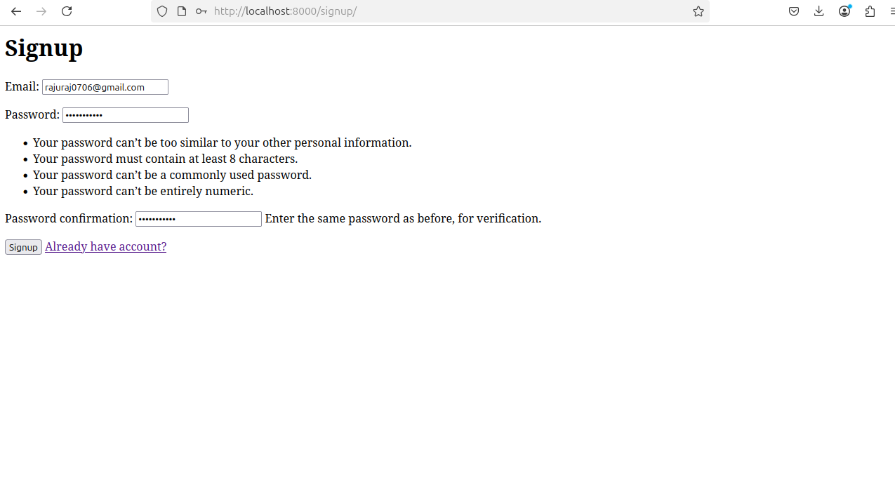
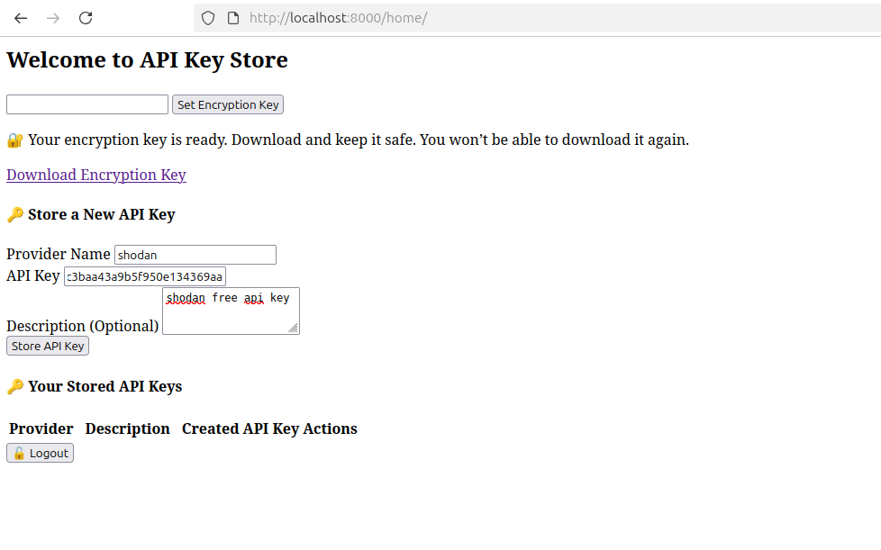

# 🔐 Django API Key Store Project

This is a secure Django-based application to store, encrypt, and manage API keys. It includes user authentication, encryption key generation, API key encryption, and decryption with download-once key protection.

---

## 🚀 Features

- User registration and login
- One-time encryption key download
- API key encryption and secure storage
- View and delete encrypted API keys
- Decryption only possible with the user's session key
- Django REST Framework-based API

---

## 📦 Requirements

- Python 3.8+
- Django 4.x+
- Django REST Framework


---

## 🛠️ Setup Instructions


### 1. Clone the repository

```bash
git clone https://github.com/yourusername/apikey-store.git
cd apikey-store
```

### 2. Activate the virtual environment

```
python -m venv venv
source venv/bin/activate  # On Windows: venv\Scripts\activate
```

### 3. Install dependencies 


``` 
pip install -r requirements.txt
```

### 4. Run Migrations

```
python manage.py makemigrations core
python manage.py migrate
```

### 5. Start the development server

``` 
python manage.py runserver
```

### 6. Endpoints

| Method   | Endpoint              | Description                       |
| -------- | --------------------- | --------------------------------- |
| `POST`   | `/signup/`            | Register a new user               |
| `POST`   | `/login/`             | Log in with email and password    |
| `POST`   | `/set-key/`           | Set encryption key in session     |
| `GET`    | `/download-key/`      | One-time encryption key download  |
| `GET`    | `/home/`              | API key management UI             |
| `POST`   | `/apikey-store/`      | Add a new encrypted API key       |
| `GET`    | `/apikey-store/`      | List all stored API keys          |
| `DELETE` | `/apikey-store/<id>/` | Delete a specific API key         |
| `POST`   | `/decrypt-apikey/`    | Decrypt API key using session key |

### 7. Encryption Design

Each user gets a unique encryption key at signup.

Key must be downloaded immediately — not stored on the server.

API keys are encrypted client-side using the key stored in the session.

Decryption works only when the correct encryption key is set in session.

### 8. Screenshots







